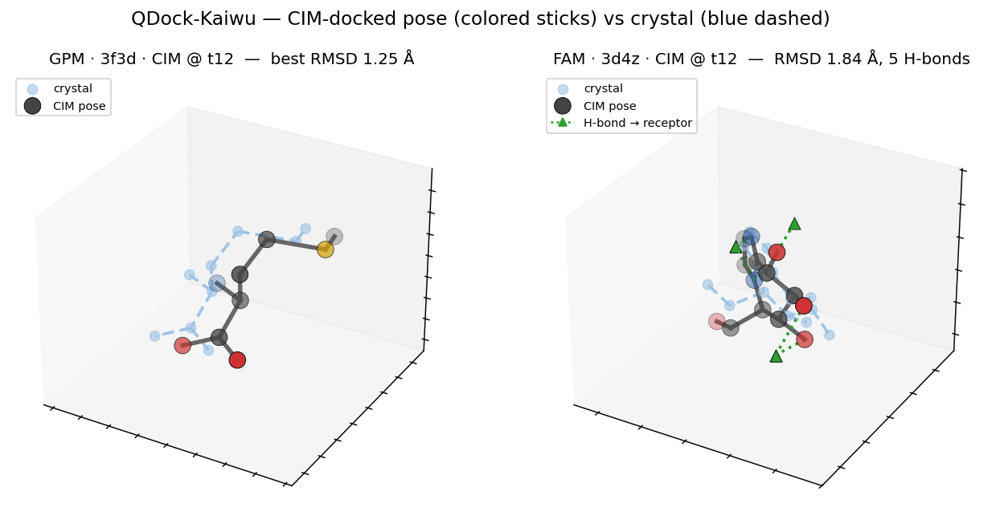

# QDock-Kaiwu — docking on the Coherent Ising Machine

Encode molecular-docking **pose sampling** as a **QUBO** and solve it on the
**Kaiwu SDK** (开物, Bose Quantum) — the classical **Simulated Annealing** solver
and the real **Coherent Ising Machine (CIM)** — then score the poses with
**AutoDock Vina**. Two encodings from Zha *et al.* (*JCTC* 2024): **Grid Point
Matching** and **Feature Atom Matching**.

The CIM is an **8-bit** machine, so a QUBO reaches it through a
`kw.cim.PrecisionReducer` that quantizes the matrix; `truncated_precision = t`
keeps `t` bits of each coefficient by splitting one variable across several spins.
The workshop's headline result: **the CIM docks better as you spend more precision
`t`** — shown on two redocking cases, each kept under the machine's ~1000-spin
budget.

| demo | encoding | target / ligand | variables | spins @ t8/t10/t12 | CIM best RMSD (t8 → t12) |
|---|---|---|---|---|---|
| **3f3d** | GPM (vdW grid) | fragment | 214 | 215 / 341 / 620 | 4.19 → 4.15 → **1.25 Å** |
| **3d4z** | FAM (features) | mannosidase II + gluco-imidazole | 336 | 337 / 495 / 920 | 3.48 → **1.65** → 1.84 Å |



## Method

**Encoding.** One binary variable per candidate match, `x_(a,s) = 1` ⇔ *ligand
atom `a` sits at site `s`*. The QUBO

```
H(x) = Σ_v w_v x_v  +  K_dist Σ_{p<q} [‖d_lig − d_site‖ > c] x_p x_q  +  K_mono Σ_{p<q}[same atom] x_p x_q
```

rewards a chemically good placement (`w`), penalizes matches that distort the
rigid ligand (`K_dist`), and forbids one atom in two sites (`K_mono`). Minimizing
`H` selects a consistent match set; superposing matched atoms onto their sites
(Kabsch) gives a 3-D pose, and many low-energy solutions give many poses.

**Two encodings** differ only in the sites:

- **GPM** — a grid filling the pocket (2.0 Å); reward `w` = van der Waals energy (AutoGrid).
- **FAM** — a few typed pocket **feature atoms** (1.0 Å); reward `w = |EN(a) − EN(s)| − 0.5`,
  so polar ligand atoms match polar features. Fewer qubits, and the docked pose
  reads out directly as hydrogen bonds.

**Solving.** Kaiwu minimizes an Ising Hamiltonian and returns ±1 spins. Convert
with `kw.conversion.qubo_matrix_to_ising_matrix(Q)` and feed the result straight
to `solve` — the converter bakes in the sign, so Kaiwu's maximizer minimizes the
QUBO (no manual `-`). The CIM path wraps the solver in a `PrecisionReducer`.

## Installation

Python 3.10 (required by the Kaiwu wheel).

```bash
python3.10 -m venv .venv && source .venv/bin/activate
python -m pip install -r requirements.txt
python -m pip install vendor/kaiwu-1.3.1-cp310-none-any.whl
python -m ipykernel install --user --name qdock-kaiwu --display-name "qdock-kaiwu"
```

`autogrid4`, `vina` and `obabel` are command-line tools, not Python packages —
install from conda-forge (found automatically on `PATH` or in a `chem` env):

```bash
conda create -y -n chem -c conda-forge python=3.11 autogrid vina openbabel
```

**License.** Free from [platform.qboson.com](https://platform.qboson.com); export
your own before running:

```bash
export KAIWU_USER_ID=<numeric id>
export KAIWU_SDK_CODE=<sdk code>
```

## Using it

The whole pipeline — build the QUBO, quantize to 8 bits, solve on the CIM, decode
to a pose:

```python
import os, numpy as np, kaiwu as kw
from qdock_kaiwu import GPMDock, backends, evaluate
from qdock_kaiwu.qubo import build_gpm_qubo
from qdock_kaiwu.gpm import _matches_to_poses
from qdock_kaiwu.params import GPM as P

kw.license.init(user_id=os.environ["KAIWU_USER_ID"], sdk_code=os.environ["KAIWU_SDK_CODE"])
kw.common.CheckpointManager.save_dir = "cim_cache"     # reuse the shipped CIM runs

g = GPMDock(backend="cim", workdir="run")
g.make_receptor("data/3f3d_protein.mol2")
g.make_ligand(["data/3f3d_ligand.mol2"])
g.make_box_ligand("data/3f3d_ligand.mol2")             # 2.0 Å grid
lig = g.ligands[0]
Q, variables = build_gpm_qubo(lig.coords, lig.ad_types, g.grid_dict, g.box_coords,
                              P["edge_cutoff"], P["K_dist"], P["K_mono"])

ising, _ = kw.conversion.qubo_matrix_to_ising_matrix(Q)                 # QUBO → Ising
cim = kw.cim.CIMOptimizer(task_name="qdock_3f3d_GPM_2p0_p8t12", wait=True,
                          interval=1, task_mode="quota", sample_number=300)
reducer = kw.cim.PrecisionReducer(cim, precision=8, truncated_precision=12,
                                  only_feasible_solution=False)         # 8-bit machine
spins = np.asarray(reducer.solve(ising))                               # quantize → submit → decode
ranked = backends._rank_unique([backends._spins_to_binary(s, Q.shape[0]) for s in spins], Q)
poses, _ = _matches_to_poses(lig, np.array(variables), g.box_coords, ranked)
print("best RMSD:", round(evaluate.pose_rmsds(np.array(poses), lig.coords, lig.elements).min(), 2), "Å")
```

Swap `kw.cim.CIMOptimizer` for `kw.classical.SimulatedAnnealingOptimizer(...,
size_limit=300)` to solve on the CPU instead — that is `backend="sa"`.

## Run

```bash
jupyter lab        # notebooks/qdock_kaiwu_workshop.ipynb, kernel "qdock-kaiwu"
python run_demo.py # both precision sweeps on the CIM, end to end
```

The notebook is the guided session: a QUBO on SA and the CIM → the GPM 3f3d
precision sweep → the FAM 3d4z sweep read out as hydrogen bonds. The CIM runs are
cached under `cim_cache/`, so it reproduces the numbers above instantly; delete a
cache file (or change `task_name`) to submit a fresh job to the hardware.

**Colab.** `notebooks/qdock_kaiwu_colab.ipynb` reproduces the poses, RMSDs,
hydrogen bonds and the 3D figure from the shipped results with only NumPy +
Matplotlib — no SDK needed (the Kaiwu wheel is macOS/Windows, so the solve runs
in the local notebook).

## Repository layout

```
notebooks/qdock_kaiwu_workshop.ipynb   the guided session (pre-run)
notebooks/qdock_kaiwu_colab.ipynb      Colab companion (NumPy + Matplotlib only)
qdock_kaiwu/                            params · qubo · backends · gpm · fam · scoring · evaluate · viz · tools
run_demo.py                            CLI: the two precision-sweep demos
instructor_notes.md                    lecture outline
data/                                  3f3d / 3d4z structures + demo_poses.npz
cim_cache/                             shipped CIM results for exact reproduction
assets/docking_demo.png                docked-vs-crystal 3D overlay
vendor/kaiwu-1.3.1-cp310-none-any.whl  the Kaiwu SDK (macOS arm64; swap wheel on other platforms)
tests/test_core.py                     license-free correctness checks
```

## References

Zha J. *et al.* "Encoding Molecular Docking for Quantum Computers." *JCTC* 2024.
DOI: 10.1021/acs.jctc.3c00943. Kaiwu SDK © QBoson; AutoGrid, AutoDock Vina,
OpenBabel under their own licenses.
